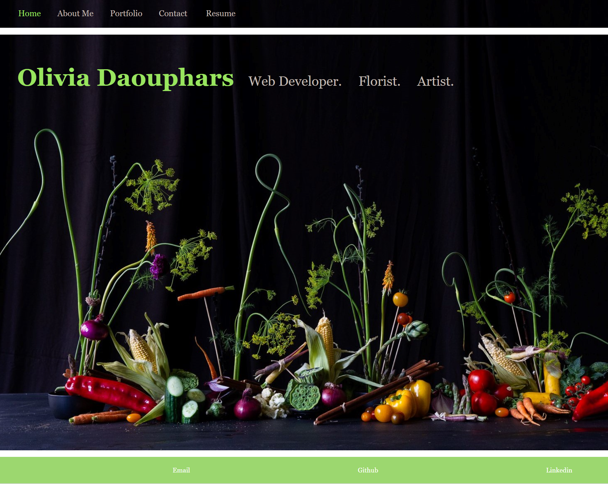

# Portfolio

## Description
This portfolio was designed to share recent web development projects and floral design work in one central location. By creating this portfolio, I will allow colleagues and future employers to readily access and view my work. I look forward to continually updating this portfolio as I create new work and learn new skills. If you have any questions, please feel free to reach out via my contact information below.

## Functionality 
When I load the portfolio, I am presented with a home page containing my name over a photo of one of my flower arrangements, a header and a footer. When I view the header I am presented with a navigation bar with titles corresponding to different sections of the portfolio such as About Me, Portfolio, Contact, and Resume. The title corresponding to the current section is highlighted. Inside of the About Me section you will find a recent photo of myself, along with a short bio. When presented with the Portfolio section, I see titled images of six of my applications with links to the deployed applications. When the Contact section is selected, I am presented with a form including fields for a name, an email address, and a message. When I click submit without entering text in all of the fields, then I receive a notification that all fields are required. When I enter text into the email address field, I receive a notification if I have entered an invalid email address.
When I click on the Resume section, my resume will be downloaded to your computer. When I view the footer I am presented with links to my Email, GitHub, and LinkedIn profiles. 

### Portfolio Link
[Portfolio Link](https://estilbee.github.io/)

### Portfolio Preview

### Technologies used
- HTML
- CSS
- JavaScript
- React
- Node
- Bootstrap

### Contact
Email: odaouphars@gmail.com